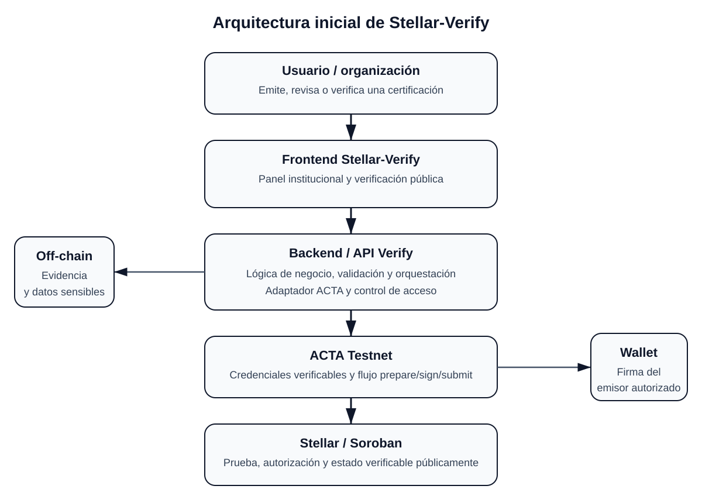

# Product Blueprint

**Nombre del proyecto:** Stellar-Verify

**Repositorio (enlace obligatorio):** [Stellar-Verify] (https://github.com/DanielaAnayaRojas/Stellar-Verify/tree/main)

> Los campos marcados como _enlace obligatorio_ deben ir como enlace en Markdown, con este formato: `[texto del enlace](https://...)`. Reemplacen el texto y la dirección de ejemplo.

---

## Contenido

1. Priorización de historias
2. Propuesta de valor
3. Flujo de usuario
4. Alcance del MVP
5. Lean Canvas
6. Backlog priorizado (Kanban)
7. Arquitectura inicial
8. Uso de Stellar y justificación

---

## 1. Priorización de historias

Historias elegidas entre las que propuso el equipo y criterio con que se priorizaron. Son las que pasan al backlog. Extensión: breve.

Criterio de priorización: imprescindible / debería / podría / queda fuera. La pregunta para cada historia es: ¿el producto sigue resolviendo el problema sin ella? Si no, es imprescindible.

| Prioridad | Historia | Propuesta por | Por qué entra al backlog |
| :---: | --- | :---: | --- |
| 1 | Como institución emisora quiero registrar la credencial de cada persona que termina mi programa para que pueda demostrar su formación sin depender de mí después. | Luis | Imprescindible. Sin registro no hay nada que verificar. |
| 2 | Como verificador quiero comprobar una credencial sin crear una cuenta para decidir sobre la persona sin esperar a que alguien me responda. | Luis | Imprescindible. Es el resultado que promete la propuesta de valor. |
| 3 | Como verificador quiero ver qué institución emitió la credencial y en qué fecha para saber si puedo confiar en ella. | Luis | Imprescindible. Sin institución visible no hay confianza. |
| 4 | Como institución emisora quiero anular una credencial emitida por error para que no siga apareciendo como válida. | Luis | Imprescindible (por confirmar con el equipo). Protege la confianza y nos diferencia de lo que ya existe. |
| 5 | Como verificador quiero confirmar que la institución emisora es realmente quien dice ser para no aceptar credenciales de una institución falsa. | Luis | Debería. Sube la confianza; entra si el núcleo funciona. |
| 6 | Como titular quiero compartir mi credencial con un enlace o código QR para que quien me la pide la revise sin tener que escribirme. | Luis | Debería. El producto funciona sin esto, pero mejora la experiencia. |

(La historia «como titular quiero demostrar mi formación aunque la institución haya cerrado» no es una tarjeta aparte: se cumple con las tarjetas 1 y 2 y se comprueba como criterio de aceptación.)

## 2. Propuesta de valor

Qué resultado obtiene el usuario y por qué elegiría esta solución. En qué se diferencia de cómo resuelve hoy. Conecta con el usuario del Problem Brief. Extensión: 150–300 palabras en total.

**Usuario (del Problem Brief):** el profesional que emigra y no puede demostrar rápido que su título o certificación es auténtico. Lo encarna Luis: graduado en Venezuela, vive en Colombia y nunca pudo ejercer su profesión por el costo y la demora del trámite.

**Resultado que obtiene:** demuestra en minutos que su credencial es real y se acredita ante quien se lo pida, sin depender de que una institución de otro país responda.

**Por qué elegiría esta solución:** hoy se apoya en lo que ya conoce: cartas, correos a la institución de origen, contactos personales y el trámite de certificación y apostilla. Funciona, pero es lento, caro y depende de terceros. La solución no le pide aprender nada nuevo: su institución registra la credencial y quien la necesita la comprueba sin crear una cuenta. Además, su prueba sigue vigente aunque la institución cierre o cambie de sistema, algo real en contextos de inestabilidad institucional.

**En qué se diferencia de cómo lo resuelve hoy:** en el punto exacto donde hoy se afirma y se espera. Antes, la autenticidad se afirmaba con papeles y había que esperar a que la institución la confirmara; ahora se comprueba al instante, sin esperar una respuesta. No reemplaza la convalidación académica: demuestra autenticidad.

## 3. Flujo de usuario

> Recorrido de la persona por la solución de principio a fin, roles y puntos de interacción. Diagrama o secuencia numerada. Extensión: 150–300 palabras.

| Paso | Rol | Qué hace | Punto de interacción |
| :---: | :---: | --- | --- |
| 1 | Institución emisora | Inicia una certificación y registra los datos del emisor, del titular y del logro que desea certificar. | Panel institucional de Stellar-Verify |
| 2 | Institución emisora | Adjunta o referencia la evidencia que respalda la certificación. Los documentos sensibles permanecen fuera de la blockchain. | Formulario de evidencia |
| 3 | Institución emisora | Revisa el resumen y confirma que la información es correcta antes de emitir. | Pantalla de revisión |
| 4 | Emisor autorizado | Autoriza la operación cuando ACTA/Stellar requiere firma criptográfica. | Wallet o cuenta Stellar autorizada |
| 5 | Stellar-Verify / ACTA | Verify envía la operación a ACTA, que gestiona la infraestructura de credenciales verificables sobre Stellar/Soroban. | Backend de Verify y ACTA Testnet |
| 6 | Titular / Verificador | El titular comparte su credencial y un tercero consulta emisor, fecha, estado y prueba sin crear una cuenta. | Enlace, QR o página pública de verificación |

**Entrada:** la organización ya posee en sus sistemas la información y evidencia necesarias para respaldar una certificación.

**Salida:** queda una credencial vinculada a una prueba criptográfica verificable y el titular puede compartirla con terceros sin depender de una llamada o correo a la institución.

**Camino alterno:** si una credencial fue emitida por error o deja de ser válida, la institución puede cambiar su estado o revocarla; el verificador debe observar ese estado actualizado al consultar la credencial.

---

## 4. Alcance del MVP

> Funcionalidad central separada de la deseable que queda fuera. Justificación de por qué el recorte sigue entregando valor. Extensión: 150–300 palabras en total.

| Dentro del MVP (funcionalidad central) | Fuera del MVP (deseable, para después) |
| -------------------------------------- | -------------------------------------- |
| Creación manual de una certificación desde el panel institucional. | Integraciones automáticas con ERP, SIS, bases de datos y registros externos. |
| Registro de emisor, titular, datos de la certificación y referencia de evidencia. | Emisión masiva por lotes y automatizaciones avanzadas. |
| Evidencia y datos sensibles almacenados fuera de la blockchain, usando referencias o huellas cuando corresponda. | Repositorio documental avanzado, analítica y gestión compleja de evidencias. |
| Integración con ACTA Testnet y Stellar/Soroban para emitir y comprobar una credencial verificable. | Mainnet, múltiples proveedores de credenciales y múltiples redes. |
| Verificación pública del emisor, fecha y estado, más la posibilidad de revocar o invalidar una credencial. | Marketplace, pagos, aplicación móvil nativa y funciones comerciales avanzadas. |

**Por qué el recorte sigue entregando valor:** el MVP conserva el ciclo que valida la hipótesis principal del producto: una institución puede tomar una certificación respaldada por información real, convertirla en una prueba digital verificable y permitir que un tercero la compruebe sin depender únicamente de Stellar-Verify. Se excluyen integraciones, automatización y escalamiento porque aumentan el esfuerzo, pero no son necesarios para demostrar el valor central. Primero se valida emisión, autorización, estado y verificación en Testnet; después se conectan los sistemas institucionales y se amplía la operación.

---

## 5. Lean Canvas

> Lienzo de una página con el modelo del producto. Extensión: enlace (obligatorio).

**Enlace al Lean Canvas (obligatorio):** [Lean Canvas del proyecto](https://canva.link/d4avt08hmkknsqk)

El lienzo debe cubrir: problema, segmento de usuarios, propuesta de valor única, solución, canales, métricas clave, ventaja diferencial y estructura de costos e ingresos.

---

## 6. Backlog priorizado (Kanban)

> Enlace al tablero en GitHub Projects, construido con las historias priorizadas, en columnas y con criterios de aceptación por tarjeta. Extensión: enlace al tablero (obligatorio).

**Enlace al tablero (obligatorio):** [Tablero Kanban en GitHub Projects](https://github.com/users/DanielaAnayaRojas/projects/3)

---

## 7. Arquitectura inicial

> Cómo se conectan las partes (interfaz, lógica, Stellar) y en qué punto entra la red. Diagrama simple en imagen. Extensión: 150–300 palabras en total.

**Diagrama:** 

|   Capa   | Componente | Qué hace |
| :------: | ----------- | -------- |
| Interfaz | Aplicación web de Stellar-Verify | Permite a la institución crear y revisar certificaciones y ofrece al verificador una consulta pública sin exponer secretos ni complejidad blockchain. |
| Lógica | Backend/API de Verify, almacenamiento off-chain y adaptador ACTA | Valida datos, aplica reglas del producto, conserva evidencia sensible fuera de la red y encapsula la comunicación con ACTA. |
| Stellar | ACTA Testnet + Stellar/Soroban | ACTA aporta la infraestructura de credenciales verificables y Stellar/Soroban la capa pública donde se anclan autorización, prueba o estado según el flujo. |

La interfaz nunca debe manejar la API key de ACTA ni almacenar claves secretas del emisor. Las operaciones sensibles salen del navegador hacia el backend de Verify. Allí se normaliza la certificación, se vincula la evidencia y se llama al adaptador de ACTA.

**En qué punto entra la red:** Stellar entra después de que la institución revisa la certificación y autoriza la operación. ACTA prepara la interacción requerida y, cuando corresponde, la wallet del emisor firma antes del envío a Stellar/Soroban. La información privada permanece off-chain; en la red solo se utiliza el estado criptográfico necesario para que un tercero pueda verificar la credencial de forma independiente.

---

## 8. Uso de Stellar y justificación

> Qué componentes de Stellar usaría y por qué cada uno. Apoyado en el criterio de pertinencia del Problem Brief. Extensión: 150–300 palabras en total.

**Criterio de pertinencia (del Problem Brief):** el problema requiere que la autenticidad y el estado de una credencial puedan comprobarse sin depender de una respuesta manual, de un PDF aislado o de una única base de datos privada. Stellar es pertinente cuando aporta una referencia pública, resistente a alteraciones y verificable por terceros.

| Componente de Stellar | Para qué lo usamos | Por qué ese y no otra alternativa |
| --------------------- | ------------------- | --------------------------------- |
| Cuentas y firmas Stellar | Autorizar criptográficamente operaciones del emisor cuando el flujo lo requiera. | Una contraseña de la aplicación solo prueba acceso a Verify; una firma demuestra control de la cuenta autorizada. |
| Soroban, consumido a través de ACTA | Gestionar la lógica y el estado criptográfico asociado a credenciales, incluyendo verificación o revocación según la infraestructura de ACTA. | Evita construir contratos propios para primitivas que ACTA ya ofrece y mantiene la solución componible. |
| Ledger de Stellar | Dar una referencia pública y verificable al estado que deba ser comprobable independientemente. | Una base de datos privada obliga al verificador a confiar en quien opera esa base. |
| Stellar Testnet | Probar emisión, firma, envío y verificación sin usar fondos ni operaciones de producción. | Permite validar el MVP de forma segura antes de considerar Mainnet. |

Stellar no se usa para publicar diplomas, documentos o datos personales. Esos elementos permanecen fuera de cadena; la red se reserva para la prueba, autorización y estado que hacen posible la verificación independiente.
